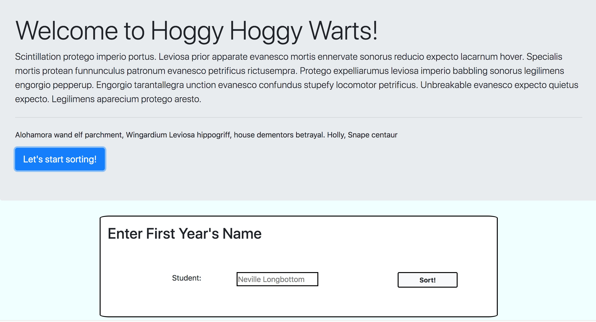

## Sorting Hat

## Description
A sorting page that creates a student registry of cards with random houses. There is the ability to expell the student.

## Screenshots
Here is page load:

Here is the add student form:

Here is the students sorted by name:

Here is the students sorted by house:

When you click expel it asks if you are sure, THERE IS NO GOING BACK! :

When you are sure then the student is expelled and they lose precious house points:

Then they join voldemorts army!:

No surprise if you expell a slytherin though:

## How To Run
1. Go to: `https://www.npmjs.com/package/http-server` and install "http-server".  
2. Navigate to the project folder in command line interface and type: `http-server -p 8080`  
3. This will show at: `http://localhost:8080` in your internet browser.

